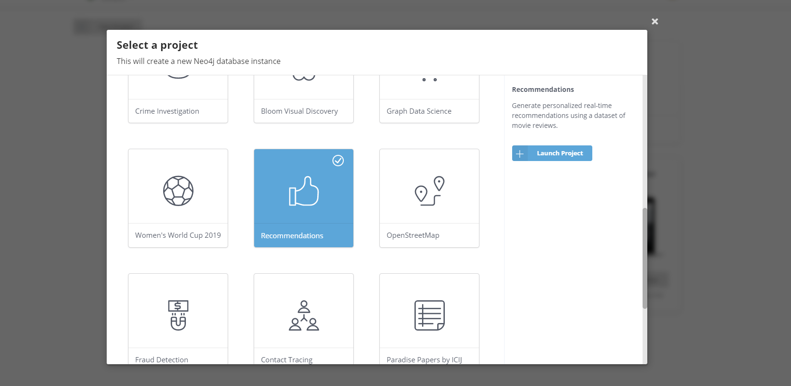
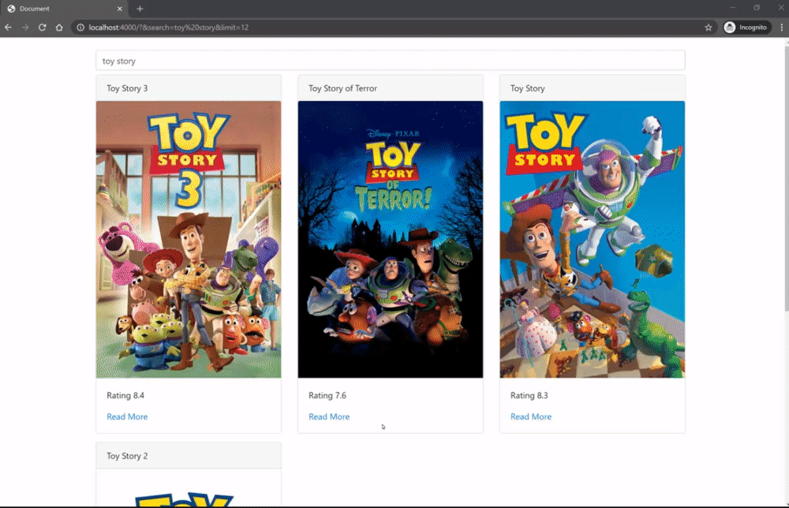

# neo4j-movies-graphql

Simple movies application built in a Typescript monorepo using @neo4j/graphql and React.js. Designed to quickly get you up and running. Comes with;

1. Apollo Server
2. Movies Schema
3. Database connections
4. Environment configuration setup(.env)
5. Linting Prettier & Eslint
6. Development ready react application with hot reload

## Schema

```graphql
type Movie {
    movieId: ID!
    title: String
    poster: String
    plot: String
    imdbRating: Float
    genres: [Genre] @relationship(type: "IN_GENRE", direction: "OUT")
    similar(skip: Int!, limit: Int!): [Movie]
        @cypher(
            statement: """
            MATCH (this)-[:IN_GENRE]->(:Genre)<-[:IN_GENRE]-(m:Movie)
            WITH m
            ORDER BY m.poster ASC, m.imdbRating DESC
            RETURN m
            SKIP $skip
            LIMIT $limit
            """
        )
}

type Genre {
    name: String!
}
```

## Getting Started

### Setting up Neo4j

This project used the recommendations database from [Neo4j Sandbox](https://neo4j.com/sandbox/). Sign up and create a new project with the recommendations dataset;



### Environment variables

Each package contains a `./env.example` file. Copy this example to, the same folder, at `./.env`. You will need to point the following environment variables to your sandbox instance;

1. NEO_USER
2. NEO_PASSWORD
3. NEO_URL

### Running the code

From the root of the monorepo run;

1. `$ npm ci`
2. `$ npm run client:dev`
3. `$ npm run server:dev`

Visit http://localhost:4000 and start browsing movies.

## Demo

### Movies


```graphql
query Movies($titleRegex: String, $limit: Int, $skip: Int, $hasNextSkip: Int) {
    movies(
        where: {
            title_REGEX: $titleRegex
            poster_NOT: null
            imdbRating_NOT: null
        }
        options: { limit: $limit, skip: $skip, sort: [imdbRating_DESC] }
    ) {
        movieId
        title
        poster
        imdbRating
    }
    hasNextMovies: movies(
        where: {
            title_REGEX: $titleRegex
            poster_NOT: null
            imdbRating_NOT: null
        }
        options: { limit: 1, skip: $hasNextSkip, sort: [imdbRating_DESC] }
    ) {
        movieId
    }
}
```

### Movie



```graphql
query Movie($movieId: ID) {
    movies(where: { movieId: $movieId }) {
        movieId
        title
        plot
        poster
        imdbRating
        similar(skip: 0, limit: 12) {
            movieId
            title
            poster
            imdbRating
        }
        genres {
            name
        }
    }
}
```
